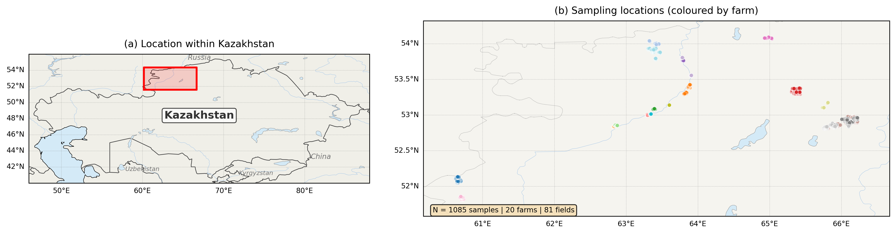
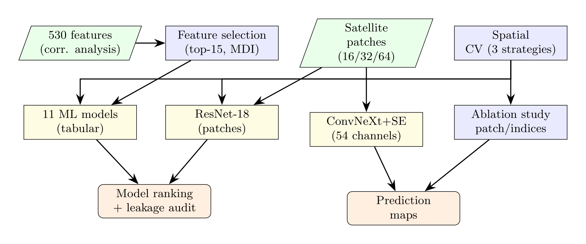
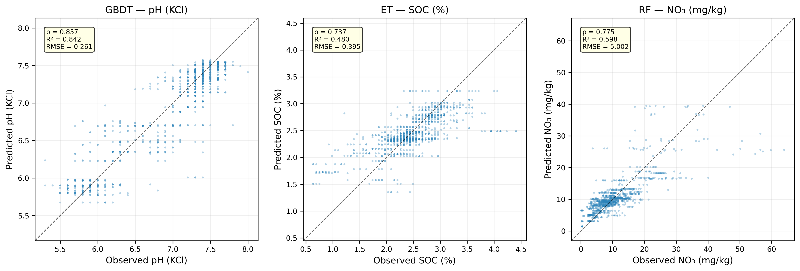
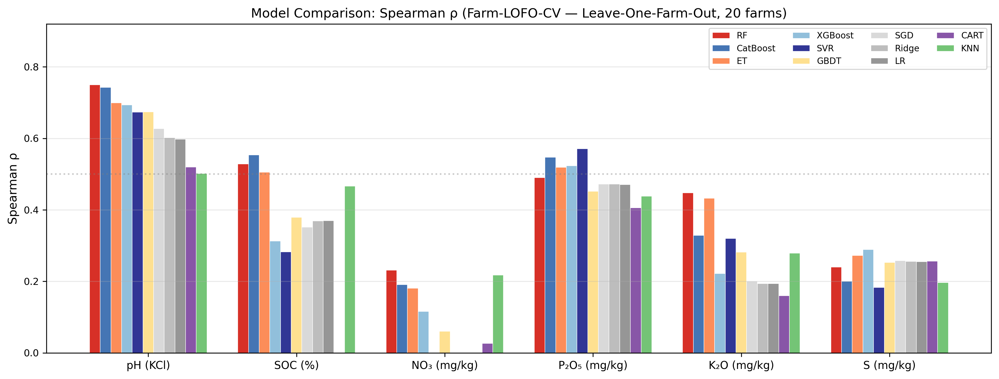
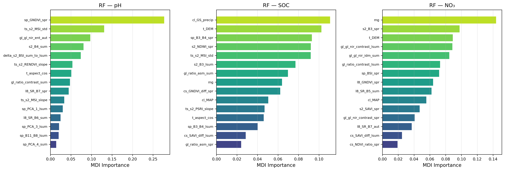
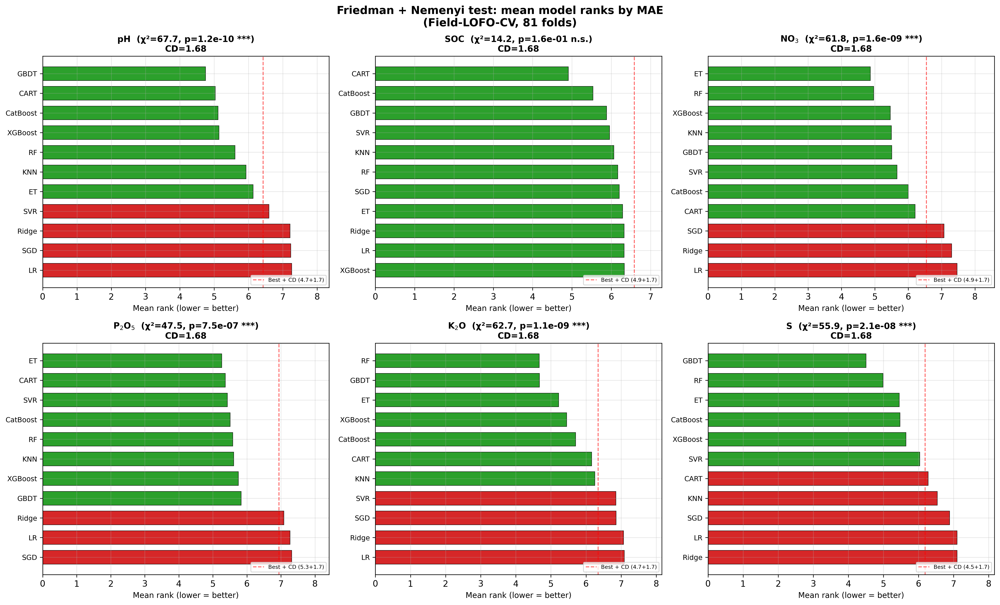
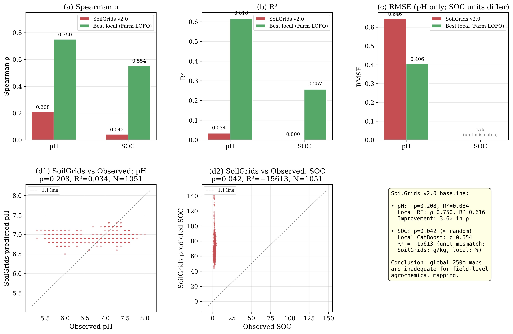

# Digital Soil Mapping — Northern Kazakhstan

[](https://doi.org/10.3390/agriculture16111239)
[](https://doi.org/10.5281/zenodo.19496423)
[](https://doi.org/10.5281/zenodo.19496443)

Predicting six agrochemical soil properties (pH, SOC, NO₃, P₂O₅, K₂O, S) from multimodal satellite
imagery using machine learning and deep learning, across the steppe zone of Northern Kazakhstan
(20 farms, 81 fields, 1,085 soil samples, 2022–2023).

## Paper

> **Yskak, A.; Yermoldina, G.T.; Nugmanov, A.B.; Rakhimbayev, B.S.; Suimenbayeva, Zh.B.; Fominov, V.D.;
> Irzhanov, Zh.B.; Paramonova, T.A.; Mamikhin, S.V.; Bulaev, A.G.** (2026).
> *Digital Soil Mapping of the Steppe Zone in Northern Kazakhstan: Predicting Agrochemical Properties of
> Soils Using Multimodal Satellite Data and Machine and Deep Learning Techniques.*
> **Agriculture** 16(11), 1239.
> **DOI: [10.3390/agriculture16111239](https://doi.org/10.3390/agriculture16111239)** ·
> [mdpi.com/2077-0472/16/11/1239](https://www.mdpi.com/2077-0472/16/11/1239)

### Authors
| Author | ORCID |
|--------|-------|
| Aliya Yskak | [0000-0002-8313-8982](https://orcid.org/0000-0002-8313-8982) |
| Gulnaz T. Yermoldina | [0000-0003-2143-7618](https://orcid.org/0000-0003-2143-7618) |
| Almabek B. Nugmanov | [0000-0002-7060-3996](https://orcid.org/0000-0002-7060-3996) |
| Berik S. Rakhimbayev | [0000-0003-3852-200X](https://orcid.org/0000-0003-3852-200X) |
| Zhanna B. Suimenbayeva | [0000-0002-2347-356X](https://orcid.org/0000-0002-2347-356X) |
| Vladimir D. Fominov | [0009-0002-1663-1803](https://orcid.org/0009-0002-1663-1803) |
| Zhassulan B. Irzhanov | [0009-0002-4009-3507](https://orcid.org/0009-0002-4009-3507) |
| Tatiana A. Paramonova | [0009-0007-0603-9407](https://orcid.org/0009-0007-0603-9407) |
| Sergey V. Mamikhin | — |
| Aleksandr G. Bulaev | [0000-0001-7914-9817](https://orcid.org/0000-0001-7914-9817) |

## Archived versions
- **Code & models** (this repository): [10.5281/zenodo.19496423](https://doi.org/10.5281/zenodo.19496423)
- **Dataset**: [10.5281/zenodo.19496443](https://doi.org/10.5281/zenodo.19496443)

## Companion study
A separate **feature-screening / feature-quality** paper — Spearman screening of 512 remote-sensing
features against the same six soil properties under leakage control (temporal alignment + out-of-farm
Farm-LOFO) — lives in its own repository and shares only the underlying soil dataset:
**[github.com/vel5id/soil-rs-correlation-screening](https://github.com/vel5id/soil-rs-correlation-screening)**
(Zenodo [10.5281/zenodo.20820838](https://doi.org/10.5281/zenodo.20820838)).

---

## Overview
This repository contains the full data-processing pipeline and modelling code for the digital soil
mapping (DSM) study above.

**Key results**
- 11 ML models + deep architectures (ResNet-18, ConvNeXt+SE) compared under three spatial validation strategies.
- Ensemble models (RF, GBDT, CatBoost) consistently outperform CNNs on tabular features.
- pH is the most predictable property: ρ = 0.750 (RF, Farm-LOFO), RPD = 1.62.
- Strict Farm-LOFO validation reveals up to ~70 % metric inflation for NO₃ relative to Field-LOFO.

## Figures
Reference figures from the published paper (DOI [10.3390/agriculture16111239](https://doi.org/10.3390/agriculture16111239)),
exported under `articles/article2_prediction/figures_for_publication/` (the full set of 22 paper figures lives there).
Each caption states the source; where a tracked script in this repository produces the figure, that script is named.

**Study area — the 20 farms and 81 fields across the Northern Kazakhstan steppe.** *Source: study-area GIS map (field boundaries).*



**End-to-end analysis workflow** — Google Earth Engine extraction → feature engineering → ML/DL modelling → spatial maps. *Source: TikZ diagram in the article LaTeX source (`articles/article2_prediction/`).*



**Predicted vs. observed** for the six soil properties. *Source: model evaluation (`ML/farm_lofo_all_models.py`, `ML/evaluate_models.py`).*



**Out-of-farm (Farm-LOFO) model comparison** across the six properties. *Source: `ML/farm_lofo_all_models.py` + `ML/plot_final_unified_comparison.py`.*



**Random-forest feature importances** (per-fold MDI under Farm-LOFO). *Source: `ML/train_rf_gridsearch_lofo.py`.*



**Friedman test + Nemenyi post-hoc** ranking of the models. *Source: Friedman/Nemenyi analysis (Figure 10 of the paper).*



**Comparison against the SoilGrids v2.0 baseline.** *Source: `ML/soilgrids_baseline.py`, `ML/generate_tl_soilgrids_figures.py`.*



**pH spatial prediction for a held-out test farm (Farm-LOFO)** — ground truth vs. RF prediction (model trained on the other 19 farms). *Source: random-forest spatial prediction (Figure 12 of the paper).*


## Project structure
```
science_SOC_predicting/
│
├── src/                         # GEE feature-extraction pipeline (s01–s12) + helpers
│   ├── s01_temperature.py … s12_glcm.py
│   ├── config.py, db_utils.py, gee_auth.py, file_utils.py
│
├── ML/                          # Predictive modelling (the paper)
│   ├── data_loader.py           #   SpatialDataLoader: Field-/Farm-LOFO CV, scaling, patches
│   ├── train_unified_ml.py      #   11 ML models, Field-LOFO & Farm-LOFO
│   ├── farm_lofo_all_models.py  #   Farm-LOFO (20-fold) for all models
│   ├── train_rf_gridsearch_lofo.py
│   ├── train_cnn.py             #   ResNet-18 (scratch & ImageNet transfer learning)
│   ├── train_multiseason_convnext.py  # ConvNeXt + SE, 54-channel multi-season
│   ├── rf_vs_cnn_spatial_split.py     # Fair RF vs CNN comparison
│   ├── soilgrids_baseline.py, deep_leakage_audit.py, leakage_and_models.py
│   ├── agronomic_metrics.py, final_ensemble_with_metrics.py
│   └── results/                 #   Modelling result tables
│
├── approximated/                # RF pixel-level prediction-map experiments
├── pre-ml/                      # Self-supervised (MAE) pretraining for sulfur
├── articles/article2_prediction/   # LaTeX source of the paper
├── scripts/                     # GEE step runners (*.sh) + utilities
├── tests/                       # pytest suite (one test per pipeline step)
├── data/                        # Derived features (gitignored; not public)
├── build_soil_db.py             # Build SQLite DB from shapefiles
└── pyproject.toml
```

## Data
| Source | Resolution | Features |
|--------|-----------|----------|
| Sentinel-2 | 10–20 m | Spectral bands, NDVI, EVI, GNDVI, BSI, … |
| Landsat-8 | 30 m | Spectral bands, indices |
| Sentinel-1 | 10 m | VV/VH backscatter (SAR) |
| SRTM DEM | 30 m | Elevation, slope, aspect, TWI, curvature |
| ERA5-Land | 0.1° | MAT, MAP, growing-season temperature & precipitation |
| SoilGrids v2.0 | 250 m | Extracted but **excluded** from modelling (leakage risk) |

**Soil samples**: 1,085 samples from 20 farms, six properties (pH, SOC, NO₃, P₂O₅, K₂O, S), lab analysis
by GOST standards. The raw soil data are **not** included here (commercially sensitive); they are
archived separately as the [dataset record](https://doi.org/10.5281/zenodo.19496443).

## Validation strategies
| Strategy | Folds | Strictness | Purpose |
|----------|-------|-----------|---------|
| **Field-LOFO** | 81 | Low | Within-farm prediction |
| **Spatial split** | 65/6/10 farms | Medium | Geographic extrapolation |
| **Farm-LOFO** | 20 | High | True out-of-farm generalization |

## Key models
| Model | Type | Best for |
|-------|------|----------|
| RF (Random Forest) | Ensemble | pH, NO₃, K₂O |
| CatBoost | Gradient boosting | SOC |
| XGBoost | Gradient boosting | S |
| SVR | Kernel | P₂O₅ |
| ResNet-18 | CNN (18-ch patches) | Ablation studies |
| ConvNeXt + SE | CNN (54-ch multi-season) | NO₃ (+36 %) |

## Quickstart
```bash
git clone https://github.com/vel5id/science_SOC_predicting.git
cd science_SOC_predicting

# base environment (Python ≥ 3.12): GEE extraction + utilities
python -m venv .venv && source .venv/bin/activate && pip install -e .

# ML environment (separate venv with PyTorch for CNN training)
cd ML && python -m venv .venv && source .venv/bin/activate
pip install scikit-learn xgboost catboost scipy pandas numpy matplotlib tqdm

# run the ML pipeline (requires data/features/master_dataset.csv)
python train_unified_ml.py
```
> The feature-extraction pipeline (`src/s01–s12`) requires Google Earth Engine authentication and the
> soil-samples database, which are not included in this repository.

## Reproducibility
- The full feature-extraction pipeline (`src/s01–s12`) is covered by **112 unit tests** that pass deterministically — run `pytest` (→ `112 passed`).
- All computations use a fixed seed (`SEED = 42`).
- The soil dataset is **not shipped in this repository** (heavy / commercially sensitive). To run the modelling pipeline, obtain it from the archived dataset record **[10.5281/zenodo.19496443](https://doi.org/10.5281/zenodo.19496443)** and place `master_dataset.csv` under `data/features/`.
- **Canonical dataset build.** The published metrics were computed on the build with **1085 samples × 530 features, 81 fields, 20 farms** (years 2022–2023). `data/features/master_dataset.csv` must be *this* build. The dataset archive also contains later/experimental builds (e.g. with additional farms/years or a reduced feature set) — those will **not** reproduce the paper, and the loader will warn (wrong field count) or fail (missing feature columns) if you use one. `SpatialDataLoader` checks this on load. See [`data/features/README.md`](data/features/README.md) for a description of every dataset file and which one to use.
- **Feature-selection config is tracked in this repo.** The per-target top-15 MDI feature lists used by the models live in `data/features/selected/*_best_features.txt` (with importances in `best_features.json`) and are version-controlled alongside the code — you do not need to regenerate them.
- Classic ML models (RF, XGBoost, CatBoost, SVR, …) run on CPU; the deep models (ResNet-18, ConvNeXt + SE) additionally require PyTorch and a GPU.
- **Headline Farm-LOFO RF (Spearman ρ), reproduced from this repo's feature config on the canonical build:** pH 0.750 · SOC 0.529 · P₂O₅ 0.490 · K₂O 0.448 · NO₃ 0.232 · S 0.240.

## Citation
```bibtex
@article{yskak2026dsm,
  title   = {Digital Soil Mapping of the Steppe Zone in Northern Kazakhstan: Predicting Agrochemical
             Properties of Soils Using Multimodal Satellite Data and Machine and Deep Learning Techniques},
  author  = {Yskak, Aliya and Yermoldina, Gulnaz T. and Nugmanov, Almabek B. and Rakhimbayev, Berik S.
             and Suimenbayeva, Zhanna B. and Fominov, Vladimir D. and Irzhanov, Zhassulan B. and
             Paramonova, Tatiana A. and Mamikhin, Sergey V. and Bulaev, Aleksandr G.},
  journal = {Agriculture},
  volume  = {16},
  number  = {11},
  pages   = {1239},
  year    = {2026},
  doi     = {10.3390/agriculture16111239}
}
```

## License
Code released for academic and research use. The associated article is published open access under
**CC BY 4.0**.
